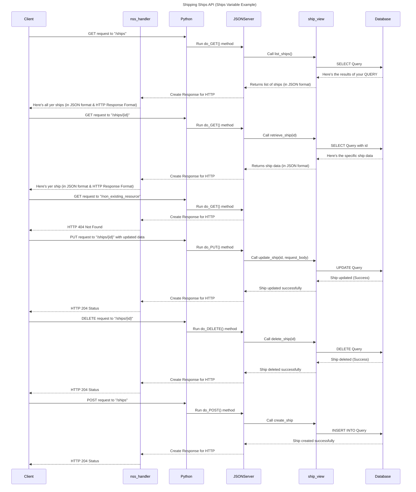

```mermaid
sequenceDiagram
    title Shipping Ships API (Ships Variable Example)

    participant Client
    participant nss_handler
    participant Python
    participant JSONServer
    participant ship_view
    participant Database

    Client->>Python: GET request to "/ships"
    Python->>JSONServer: Run do_GET() method
    JSONServer->>ship_view: Call list_ships()
    ship_view->>Database: SELECT Query
    Database-->>ship_view: Here's the results of your QUERY
    ship_view-->>JSONServer: Returns list of ships (in JSON format)
    JSONServer-->>nss_handler: Create Response for HTTP
    nss_handler-->>Client: Here's all yer ships (in JSON format & HTTP Response Format) 

    Client->>Python: GET request to "/ships/{id}"
    Python->>JSONServer: Run do_GET() method
    JSONServer->>ship_view: Call retrieve_ship(id)
    ship_view->>Database: SELECT Query with id
    Database-->>ship_view: Here's the specific ship data
    ship_view-->>JSONServer: Returns ship data (in JSON format)
    JSONServer-->>nss_handler: Create Response for HTTP
    nss_handler-->>Client: Here's yer ship (in JSON format & HTTP Response Format)

    Client->>Python: GET request to "/non_existing_resource"
    Python->>JSONServer: Run do_GET() method
    JSONServer-->>nss_handler: Create Response for HTTP
    nss_handler-->>Client: HTTP 404 Not Found

    Client->>Python: PUT request to "/ships/{id}" with updated data
    Python->>JSONServer: Run do_PUT() method
    JSONServer->>ship_view: Call update_ship(id, request_body)
    ship_view->>Database: UPDATE Query
    Database-->>ship_view: Ship updated (Success)
    ship_view-->>JSONServer: Ship updated successfully
    JSONServer-->>nss_handler: Create Response for HTTP
    nss_handler-->>Client: HTTP 204 Status

    Client->>Python: DELETE request to "/ships/{id}"
    Python->>JSONServer: Run do_DELETE() method
    JSONServer->>ship_view: Call delete_ship(id)
    ship_view->>Database: DELETE Query
    Database-->>ship_view: Ship deleted (Success)
    ship_view-->>JSONServer: Ship deleted successfully
    JSONServer-->>nss_handler: Create Response for HTTP
    nss_handler-->>Client: HTTP 204 Status

    Client->>Python: POST request to "/ships"
    Python->>JSONServer: Run do_POST() method
    JSONServer->>ship_view: Call create_ship
    ship_view->>Database: INSERT INTO Query
    Database-->>JSONServer: Ship created successfully
    JSONServer-->>nss_handler: Create Response for HTTP
    nss_handler-->>Client: HTTP 204 Status
```